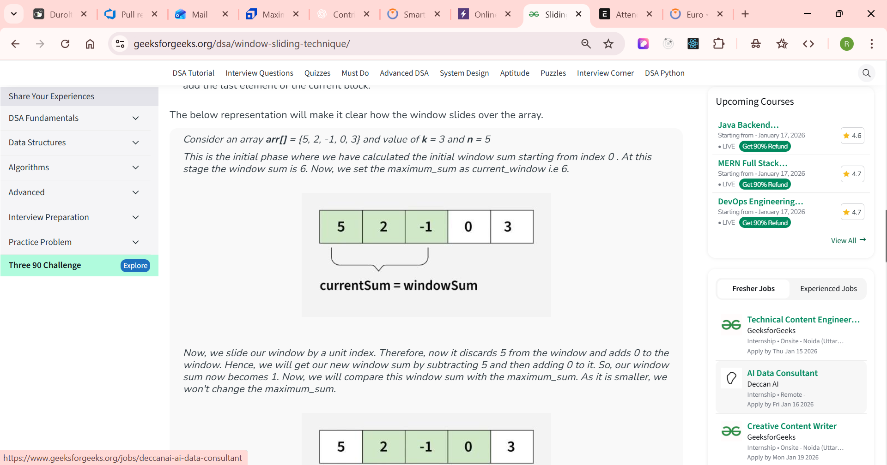
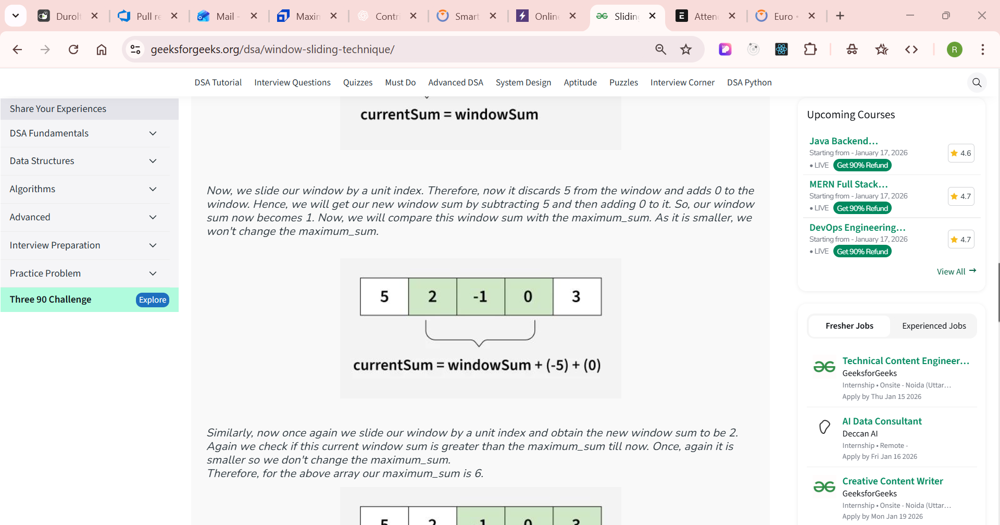
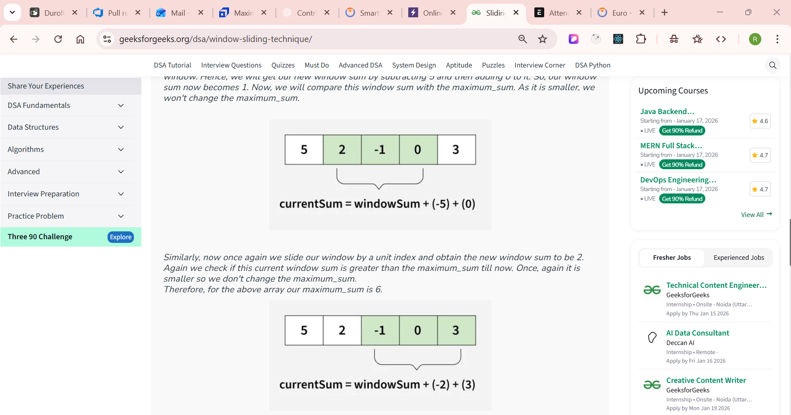

## ------ Contribution Technique & Sliding Window with full notes ---
Sure! Let’s go **deep and structured** on **Contribution Technique** and **Sliding Window** in DSA (Data Structures & Algorithms) with full notes, examples, and time/space complexity. I’ll make it **easy to understand**, step by step.

---

# **1️⃣ Contribution Technique**

### **Definition:**

The **Contribution Technique** is a way of solving problems by calculating the **contribution of each element** to the final answer, instead of iterating over all subarrays/subsets explicitly.

It’s often used to **reduce time complexity** from `O(n^2)` or `O(n^3)` to `O(n)` or `O(n log n)`.

---

### **Idea:**

Instead of generating all possible subarrays:

1. Analyze **how many times each element contributes** to the answer.
2. Multiply the element by the number of subarrays/subsets it appears in.
3. Sum all contributions.

---

### **Steps:**

1. Find **all subarrays or subsets** where the element appears.
2. Calculate the **number of times the element contributes**.
3. Multiply element value by the contribution count.
4. Sum it up for all elements.

---

### **Example 1: Sum of all subarray sums**

**Problem:**
Given `arr = [1, 2, 3]`, find the sum of **all subarrays**.

**Naive way:** Generate all subarrays → `O(n^2)`.

**Contribution Technique:**

* For `arr[i]`, the **number of subarrays it appears in** = `(i + 1) * (n - i)`.
* Explanation:

  * `i+1` → choices for starting point (0..i)
  * `n-i` → choices for ending point (i..n-1)

```java
int[] arr = {1, 2, 3};
int n = arr.length;
int sum = 0;

for (int i = 0; i < n; i++) {
    int contribution = arr[i] * (i + 1) * (n - i);
    sum += contribution;
}

System.out.println(sum); // Output: 20
```

✅ **Explanation:**

* Subarrays: `[1] [1,2] [1,2,3] [2] [2,3] [3]`
* Sum = 1+3+6+2+5+3 = 20 ✅

**Time Complexity:** `O(n)`
**Space Complexity:** `O(1)`

---

### **Example 2: Count of subarrays with `arr[i]` as maximum**

* Used in problems like **Maximum of all subarrays of size k** or **Sum of subarray maximums**.
* Each element contributes to some subarrays as maximum → use **Contribution technique**.

---

### **Advantages of Contribution Technique**

* Avoids nested loops → **faster**.
* Works well for **sum, max, min, XOR**, etc.
* Very common in **competitive programming**.

---

# **2️⃣ Sliding Window Technique**

### **Definition:**

**Sliding Window** is used to optimize **subarray / substring problems** of **contiguous elements**, reducing **O(n^2) → O(n)**.

---

### **Idea:**

* Keep a **window** (subarray/substring) of size `k` (fixed or variable).
* Slide the window across the array/string.
* Update result **incrementally** instead of recalculating.

---

### **Types of Sliding Window**

1. **Fixed-size Window**

   * Window size is fixed (`k` elements)
2. **Variable-size Window**

   * Expand/contract the window dynamically based on condition.

---

### **Example 1: Maximum sum of subarray of size k**

**Problem:** Find max sum of subarray of size `k` in `arr = [1, 2, 3, 4, 5]`, `k = 3`

**Naive way:** Iterate all subarrays → `O(n*k)`

**Sliding Window:**

```java
int[] arr = {1, 2, 3, 4, 5};
int n = arr.length;
int k = 3;
int sum = 0;

// Sum of first window
for (int i = 0; i < k; i++) sum += arr[i];

int maxSum = sum;

// Slide the window
for (int i = k; i < n; i++) {
    sum = sum + arr[i] - arr[i - k]; // add new, remove old
    maxSum = Math.max(maxSum, sum);
}

System.out.println(maxSum); // Output: 12 ([3,4,5])
```

✅ **Time Complexity:** `O(n)`
✅ **Space Complexity:** `O(1)`

---

### **Example 2: Longest substring with at most k distinct characters**

* Use **variable-size sliding window**:

  * Expand window by moving right pointer
  * Shrink window from left if condition violated
* Used in strings and arrays.

```java
String s = "eceba";
int k = 2;
Map<Character, Integer> map = new HashMap<>();
int left = 0, maxLen = 0;

for (int right = 0; right < s.length(); right++) {
    char c = s.charAt(right);
    map.put(c, map.getOrDefault(c, 0) + 1);

    while (map.size() > k) {
        char leftChar = s.charAt(left);
        map.put(leftChar, map.get(leftChar) - 1);
        if (map.get(leftChar) == 0) map.remove(leftChar);
        left++;
    }

    maxLen = Math.max(maxLen, right - left + 1);
}

System.out.println(maxLen); // Output: 3 ("ece")
```

✅ **Time Complexity:** `O(n)`
✅ **Space Complexity:** `O(k)`

---

### **Key Points of Sliding Window**

1. Avoid recomputation inside a window → update incrementally.
2. Works for **contiguous subarrays/strings**.
3. Can be **fixed or variable size**.

---

# **3️⃣ Contribution Technique vs Sliding Window**

| Aspect     | Contribution Technique                             | Sliding Window                                                    |
| ---------- | -------------------------------------------------- | ----------------------------------------------------------------- |
| Works for  | Sum, max, min, XOR, all subarrays                  | Contiguous subarray/substring problems                            |
| Complexity | Often `O(n)`                                       | `O(n)`                                                            |
| Idea       | Count how each element contributes to final answer | Keep a moving window, add/remove elements incrementally           |
| Use Cases  | Sum of all subarrays, subarray max/min sum         | Max sum subarray of size k, longest substring with k unique chars |

---

# **4️⃣ Summary & Tips**

* **Contribution Technique:**

  * Focus on **element contribution** to subarrays/subsets.
  * Avoids nested loops.
  * Use math formulas: `(i+1)*(n-i)` or similar.

* **Sliding Window:**

  * Keep a window, **slide it** while updating result.
  * Works best for **contiguous sequences**.
  * Fixed size → add new, remove old.
  * Variable size → expand/shrink based on condition.

* **Combined Approach:**

  * Some problems need both: Contribution for counting + Sliding Window for efficiency.

---

If you want, I can make a **full “one-page cheat sheet”** with:

* **Formulas**
* **Java templates**
* **Common DSA problems solved using Contribution & Sliding Window**

It’ll be **ready to revise before interviews**.

Do you want me to make that?


## -------Sliding Window Technique from geeksforgeeks ---------
Sliding Window Technique is a method used to solve problems that involve subarray or substring or window.

- Instead of repeatedly iterating over the same elements, the sliding window maintains a range (or “window”) that moves step-by-step through the data, updating results incrementally.
- The main idea is to use the results of previous window to do computations for the next window.
- Commonly used for problems like finding subarrays with a specific sum, finding the longest substring with unique characters, or solving problems that require a fixed-size window to process elements efficiently.

- Table of Content
1) Example Problem - Maximum Sum of a Subarray with K Elements
2) Naive Approach - O(n×k) Time and O(1) Space
3) Using the Sliding Window Technique - O(n) Time and O(1) Space
4) How to use Sliding Window Technique?
5) How to Identify Sliding Window Problems?
6) More Example Problems


1) Example Problem - Maximum Sum of a Subarray with K Elements
Given an array arr[] and an integer k, we need to calculate the maximum sum of a subarray having size exactly k.

Input  : arr[] = [5, 2, -1, 0, 3], k = 3
Output : 6
Explanation : We get maximum sum by considering the subarray [5, 2 , -1]

Input  : arr[] = [1, 4, 2, 10, 23, 3, 1, 0, 20], k = 4 
Output : 39
Explanation : We get maximum sum by adding subarray [4, 2, 10, 23] of size 4.

```java
class GFG {
    // Returns maximum sum in
    // a subarray of size k.
    static int maxSum(int arr[], int n, int k){
        // Initialize result
        int max_sum = Integer.MIN_VALUE;

        // Consider all blocks starting with i.
        for (int i = 0; i < n - k + 1; i++) {
            int current_sum = 0;
            for (int j = 0; j < k; j++)
                current_sum = current_sum + arr[i + j];

            // Update result if required.
            max_sum = Math.max(current_sum, max_sum);
        }

        return max_sum;
    }

    public static void main(String[] args){
        int arr[] = {5, 2, -1, 0, 3};
        int k = 3;
        int n = arr.length;
        System.out.println(maxSum(arr, n, k));
    }
}
```
Output
```
6
```
Using the Sliding Window Technique - O(n) Time and O(1) Space
 - We compute the sum of the first k elements out of n terms using a linear loop and store the sum in variable window_sum.
 - Then we will traverse linearly over the array till it reaches the end and simultaneously keep track of the maximum sum.
 - To get the current sum of a block of k elements just subtract the first element from the previous block and add the last element of the current block.

The below representation will make it clear how the window slides over the array.

- Consider an array arr[] = {5, 2, -1, 0, 3} and value of k = 3 and n = 5 
- This is the initial phase where we have calculated the initial window sum starting from index 0 . At this stage the window sum is 6. Now, we set the maximum_sum as current_window i.e 6
1) 
2) 
3) 

```java 
class GFG {

    static int maxSum(int arr[], int n, int k){
        // n must be greater
        if (n <= k) {
            System.out.println("Invalid");
            return -1;
        }

        // Compute sum of first window of size k
        int max_sum = 0;
        for (int i = 0; i < k; i++)
            max_sum += arr[i];

        // Compute sums of remaining windows by
        // removing first element of previous
        // window and adding last element of
        // current window.
        int window_sum = max_sum;
        for (int i = k; i < n; i++) {
            window_sum += arr[i] - arr[i - k];
            max_sum = Math.max(max_sum, window_sum);
        }

        return max_sum;
    }

    public static void main(String[] args){
        int arr[] = {5, 2, -1, 0, 3};
        int k = 3;
        int n = arr.length;
        System.out.println(maxSum(arr, n, k));
    }
}
```

How to use Sliding Window Technique?
  - There are basically two types of sliding window:

1. Fixed Size Sliding Window:

   The general steps to solve these questions by following below steps:

-  Find the size of the window required, say K.
- Compute the result for 1st window, i.e. include the first K elements of the data structure.
- Then use a loop to slide the window by 1 and keep computing the result window by window.

2. Variable Size Sliding Window:

   The general steps to solve these questions by following below steps:

 - In this type of sliding window problem, we increase our right pointer one by one till our condition is true.
- At any step if our condition does not match, we shrink the size of our window by increasing left pointer.
- Again, when our condition satisfies, we start increasing the right pointer and follow step 1.
- We follow these steps until we reach to the end of the array.

How to Identify Sliding Window Problems?

- These problems generally require Finding Maximum/Minimum Subarray, Substrings which satisfy some specific condition.
- The size of the subarray or substring ‘k’ will be given in some of the problems.
- These problems can easily be solved in O(n2) time complexity using nested loops, using sliding window we can solve these in O(n) Time Complexity.
- Required Time Complexity: O(n) or O(n log n)
- Constraints: n <= 106


## ------ find total subarray of a array with length k --
Your idea is **almost correct**, but there are **syntax errors** and a **small formula mistake**.
I’ll do this in **3 clean steps**:

1️⃣ Fix the **Java code**
2️⃣ Correct the **logic & formula**
3️⃣ Give a **clear dry diagram** so you never forget it

---

## ❌ Problems in Your Code

### 1️⃣ Array syntax is wrong

```java
int[] a = new [1,2,3,4,5,6,7,8]; ❌
```

✅ Correct:

```java
int[] a = {1,2,3,4,5,6,7,8};
```

---

### 2️⃣ Formula is incorrect

You wrote:

```java
arrlength - (k + 1)
```

✅ Correct formula:

```
Total subarrays of length k = n - k + 1
```

---

## ✅ Correct & Working Code

```java
public class Main {
    public static void main(String[] args) {

        int[] a = {1,2,3,4,5,6,7,8};
        int k = 3;

        int arrLength = a.length;

        int totalSubarrays = arrLength - k + 1;

        System.out.println("Total subarrays of length " + k + " is: " + totalSubarrays);
    }
}
```

---

## 🧪 DRY RUN WITH DIAGRAM (VERY IMPORTANT)

### Input

```
Array: [1,2,3,4,5,6,7,8]
Index:  0 1 2 3 4 5 6 7
n = 8
k = 3
```

---

### Formula Applied

```
Total subarrays = n - k + 1
                = 8 - 3 + 1
                = 6
```

---

## 📐 DIAGRAM: ALL SUBARRAYS OF LENGTH k = 3

```
Subarray 1 → indices (0 to 2)
[1, 2, 3]
 ↑  ↑  ↑

Subarray 2 → indices (1 to 3)
[2, 3, 4]
    ↑  ↑  ↑

Subarray 3 → indices (2 to 4)
[3, 4, 5]
       ↑  ↑  ↑

Subarray 4 → indices (3 to 5)
[4, 5, 6]
          ↑  ↑  ↑

Subarray 5 → indices (4 to 6)
[5, 6, 7]
             ↑  ↑  ↑

Subarray 6 → indices (5 to 7)
[6, 7, 8]
                ↑  ↑  ↑
```

---

## ✅ Why Formula Works (INTUITION)

* First window starts at index `0`
* Last window starts at index `n - k`
* Count of start positions:

```
(n - k) - 0 + 1 = n - k + 1
```

---

## 🎯 FINAL ANSWER

```
Total subarrays of length 3 = 6
```

---

If you want next:
✔ Sliding Window sum of size K
✔ Max sum subarray of size K
✔ Same logic with negative numbers
✔ Convert this into optimized sliding window code

Just tell me 👍

## - Q:2 print start and end index of a subarray of an array of length k -----
Good question 👍
Your **logic is correct**, but there is **one conceptual mistake** and I’ll explain it **clearly with dry diagram**, step by step.

---

## ❌ Issue in Your Code

You wrote:

```java
System.out.println("Start index is:"+ a[sIndex] + " End inde is:"+ a[eIndex]);
```

👉 This prints **VALUES**, not **INDICES**.

But the question says:

> **print start and end index of subarray**

So you should print:

```java
sIndex and eIndex
```

---

## ✅ Corrected Code (Printing INDICES)

```java
public class Main {
    public static void main(String[] args) {

        int[] a = {1,2,3,4,5,6,7,8};
        int k = 3;

        int arrLength = a.length;

        int sIndex = 0;
        int eIndex = k - 1;

        while (eIndex < arrLength) {
            System.out.println("Start index: " + sIndex + ", End index: " + eIndex);
            sIndex++;
            eIndex++;
        }
    }
}
```

---

## 🧪 FULL DRY RUN WITH DIAGRAM (NOT SKIPPING ANYTHING)

### Input

```
Array: [1,2,3,4,5,6,7,8]
Index:  0 1 2 3 4 5 6 7
k = 3
```

---

## Initial Values

```
sIndex = 0
eIndex = k - 1 = 2
arrLength = 8
```

---

## 🔁 WHILE LOOP EXECUTION

### 🔹 Iteration 1

```
Condition: eIndex < arrLength
2 < 8 → TRUE
```

Print:

```
Start index: 0, End index: 2
```

Subarray:

```
[1, 2, 3]
 ↑     ↑
 0     2
```

Update:

```
sIndex = 1
eIndex = 3
```

---

### 🔹 Iteration 2

```
3 < 8 → TRUE
```

Print:

```
Start index: 1, End index: 3
```

Subarray:

```
[2, 3, 4]
    ↑     ↑
    1     3
```

Update:

```
sIndex = 2
eIndex = 4
```

---

### 🔹 Iteration 3

```
4 < 8 → TRUE
```

Print:

```
Start index: 2, End index: 4
```

Subarray:

```
[3, 4, 5]
       ↑     ↑
       2     4
```

---

### 🔹 Iteration 4

```
5 < 8 → TRUE
```

Print:

```
Start index: 3, End index: 5
```

Subarray:

```
[4, 5, 6]
          ↑     ↑
          3     5
```

---

### 🔹 Iteration 5

```
6 < 8 → TRUE
```

Print:

```
Start index: 4, End index: 6
```

Subarray:

```
[5, 6, 7]
             ↑     ↑
             4     6
```

---

### 🔹 Iteration 6

```
7 < 8 → TRUE
```

Print:

```
Start index: 5, End index: 7
```

Subarray:

```
[6, 7, 8]
                ↑     ↑
                5     7
```

---

### 🔹 Iteration 7

```
8 < 8 → FALSE
```

❌ Loop stops

---

## 🔚 END OF PROGRAM

---

## ✅ FINAL OUTPUT

```
Start index: 0, End index: 2
Start index: 1, End index: 3
Start index: 2, End index: 4
Start index: 3, End index: 5
Start index: 4, End index: 6
Start index: 5, End index: 7
```

---

## 🎯 Important Interview Note

* **Indices** → `sIndex`, `eIndex`
* **Values** → `a[sIndex]`, `a[eIndex]`
* Sliding window moves by:

```
sIndex++
eIndex++
```

---

If you want next:
✔ Print actual subarrays
✔ Sliding window sum of size k
✔ Max / Min subarray of size k
✔ Same with negative numbers

Just tell me 👍

###### ------------  Q:3 print the max vlaue of adding of subarray of an array with length k ------
```java
public class Main
{
	public static void main(String[] args) {
		//System.out.println("Hello World");
		int[] a = {10,20,30,40,50,60,70,80};
		int k = 3;
		// Q:3 print all the subarray with length k of array
	    // step-1: find the length of array 
	    int arrlength = a.length;
	    int sIndex = 0;
	    int eIndex  = k - 1;
	    int ans = 0;
	   while(eIndex < arrlength){
	       int sum = 0;
	       for(int i = sIndex; i <= eIndex; i++){
	          // System.out.print(a[i]);
	          sum = sum + a[i];
	       }
	       if(ans < sum){
	           ans = sum;
	       }else{
	           ans = ans;
	       }
	       //System.out.println();
	       sIndex++;
	       eIndex++;
	   }
	   System.out.print(ans);
		
		
	}
}

```
Perfect 👍
We’ll solve **Q3: Maximum sum subarray of fixed length `k`**
**step-by-step from O(n²) → O(n)** with:

✔ Full **code**
✔ Full **dry run**
✔ Clear **diagrams**
✔ Explicitly showing **when max updates & when it doesn’t**

---

# 📌 PROBLEM

**Given an integer array and an integer `k`, find the maximum sum of any subarray of length `k`.**

### Example

```
A = [2, 1, 5, 1, 3, 2]
k = 3
```

Subarrays of length 3:

```
[2,1,5] → sum = 8
[1,5,1] → sum = 7
[5,1,3] → sum = 9   ✅ max
[1,3,2] → sum = 6
```

👉 **Answer = 9**

---

# 🔴 APPROACH 1: O(n²) — BRUTE FORCE

---

## ✅ CODE (O(n²))

```java
public class Main {
    public static void main(String[] args) {

        int[] a = {2, 1, 5, 1, 3, 2};
        int k = 3;
        int n = a.length;

        int maxSum = Integer.MIN_VALUE;

        for (int i = 0; i <= n - k; i++) {
            int currentSum = 0;

            for (int j = i; j < i + k; j++) {
                currentSum += a[j];
            }

            if (currentSum > maxSum) {
                maxSum = currentSum;
            }
        }

        System.out.println("Maximum sum subarray = " + maxSum);
    }
}
```

---

## 🧪 FULL DRY RUN (O(n²))

### Input

```
Array: [2, 1, 5, 1, 3, 2]
Index:  0  1  2  3  4  5
k = 3
maxSum = -∞
```

---

### 🔹 i = 0

Subarray indices → `0 to 2`

```
[2, 1, 5]
 ↑     ↑
```

Calculation:

```
currentSum = 2 + 1 + 5 = 8
```

Comparison:

```
8 > -∞ → YES
maxSum = 8
```

---

### 🔹 i = 1

Subarray indices → `1 to 3`

```
[1, 5, 1]
    ↑     ↑
```

```
currentSum = 1 + 5 + 1 = 7
7 > 8 → NO
maxSum remains 8
```

---

### 🔹 i = 2

Subarray indices → `2 to 4`

```
[5, 1, 3]
       ↑     ↑
```

```
currentSum = 5 + 1 + 3 = 9
9 > 8 → YES
maxSum = 9
```

---

### 🔹 i = 3

Subarray indices → `3 to 5`

```
[1, 3, 2]
          ↑     ↑
```

```
currentSum = 1 + 3 + 2 = 6
6 > 9 → NO
```

---

### 🔚 RETURN

```
maxSum = 9
```

---

# 🟢 APPROACH 2: O(n) — SLIDING WINDOW (OPTIMIZED)

---

## 💡 KEY IDEA

Instead of recalculating sum every time:

* **Add next element**
* **Remove previous element**

---

## ✅ CODE (O(n))

```java
public class Main {
    public static void main(String[] args) {

        int[] a = {2, 1, 5, 1, 3, 2};
        int k = 3;
        int n = a.length;

        int windowSum = 0;
        int maxSum = Integer.MIN_VALUE;

        // First window
        for (int i = 0; i < k; i++) {
            windowSum += a[i];
        }
        maxSum = windowSum;

        int s = 0;

        // Slide the window
        for (int e = k; e < n; e++) {
            windowSum += a[e];   // add next
            windowSum -= a[s];   // remove previous
            s++;

            if (windowSum > maxSum) {
                maxSum = windowSum;
            }
        }

        System.out.println("Maximum sum subarray = " + maxSum);
    }
}
```

---

## 🧪 FULL DRY RUN (O(n))

### Step 1: First window sum

```
Window: [2,1,5]
windowSum = 8
maxSum = 8
```

```
[2, 1, 5]
 ↑     ↑
```

---

### Step 2: Slide window

---

#### 🔹 Move to window [1,5,1]

```
Add a[3] = 1
Remove a[0] = 2
windowSum = 8 + 1 - 2 = 7
```

Comparison:

```
7 > 8 → NO
```

```
[1, 5, 1]
    ↑     ↑
```

---

#### 🔹 Move to window [5,1,3]

```
Add a[4] = 3
Remove a[1] = 1
windowSum = 7 + 3 - 1 = 9
```

Comparison:

```
9 > 8 → YES
maxSum = 9
```

```
[5, 1, 3]
       ↑     ↑
```

---

#### 🔹 Move to window [1,3,2]

```
Add a[5] = 2
Remove a[2] = 5
windowSum = 9 + 2 - 5 = 6
```

Comparison:

```
6 > 9 → NO
```

```
[1, 3, 2]
          ↑     ↑
```

---

### 🔚 LOOP END → RETURN

```
maxSum = 9
```

---

# 🧠 FINAL COMPARISON

| Approach | Time | Idea                       |
| -------- | ---- | -------------------------- |
| O(n²)    | Slow | Recalculate every subarray |
| O(n)     | Fast | Sliding window             |

---

## 🎯 INTERVIEW GOLD LINE

> “For fixed-size subarrays, **Sliding Window** gives O(n) solution.”

---

If you want next:
✔ Minimum sum subarray
✔ Variable size sliding window
✔ Same with negative numbers
✔ Kadane’s algorithm comparison

Just tell me 👍

## --- so how i  can i identifye that qiestion is relat4ed to k type or Variable Size Sliding Window or if a question is here so we can solve it with thses both way or a particulr question only we can solve by that particulr way  ---

Excellent question 👏
This is **THE** most important sliding-window concept for interviews.

I’ll give you a **clear decision framework** so that **within 10 seconds of reading a question**, you know:

✔ Fixed-K window
✔ Variable window
✔ Both possible
✔ Sliding window NOT applicable

No code — only **thinking rules**.

---

# 🧠 STEP-BY-STEP DECISION FRAMEWORK

## 🔹 STEP 1: Does the question say **“size = k”** explicitly?

### Keywords:

* “subarray of size k”
* “window of length k”
* “k consecutive elements”

### ✅ YES → **FIXED SIZE Sliding Window**

❌ NO → go to Step 2

📌 Example:

> Max sum of subarray of size **k**

---

## 🔹 STEP 2: Is there a **constraint** instead of a size?

### Keywords:

* “sum ≤ B”
* “sum ≥ K”
* “at most K”
* “at least K”
* “no more than”
* “longest / smallest subarray satisfying condition”

### ✅ YES → **VARIABLE SIZE Sliding Window**

❌ NO → go to Step 3

📌 Example:

> Longest subarray with sum ≤ B

---

## 🔹 STEP 3: Are all numbers **non-negative**?

### If the array has:

* Only positive or zero → Sliding window POSSIBLE
* Any negative number → Sliding window ❌

📌 If negatives exist → use:

* Prefix sum
* HashMap
* Kadane
* Binary search on prefix sums

---

# 🟢 QUICK IDENTIFICATION TABLE

| Question Pattern              | Sliding Window Type   |
| ----------------------------- | --------------------- |
| “size k”                      | Fixed                 |
| “exactly k”                   | Fixed                 |
| “≤ / ≥ condition”             | Variable              |
| “longest / smallest subarray” | Variable              |
| Negative numbers              | ❌ Not sliding window  |
| Count subarrays               | Variable / Prefix sum |

---

# 🔴 CAN A QUESTION BE SOLVED BOTH WAYS?

### ✅ YES — sometimes

Example:

> Maximum sum subarray of size k

| Approach       | Time        |
| -------------- | ----------- |
| Brute force    | O(N²)       |
| Prefix sum     | O(N)        |
| Sliding window | O(N) ← BEST |

But:

> Maximum sum ≤ B
> 👉 **Only variable sliding window** (if positives)

---

# 🔥 REAL INTERVIEW EXAMPLES

### Q1:

> Maximum average of subarray of size k

✔ Fixed window
✔ Cannot be variable

---

### Q2:

> Longest subarray with sum ≤ B

✔ Variable window
❌ Fixed window impossible

---

### Q3:

> Count subarrays with sum = K (contains negatives)

❌ Sliding window
✔ Prefix sum + HashMap

---

# 🧠 ONE-LINE RULE (MEMORIZE THIS)

> **Fixed size = k is given**
> **Variable size = constraint is given**

---

# 🧩 DECISION FLOWCHART (Mental Diagram)

```
Does question mention k?
   ├── YES → Fixed Window
   └── NO
        ↓
Is there a condition (≤, ≥, at most)?
   ├── YES → Variable Window
   └── NO
        ↓
Are negatives present?
   ├── YES → Prefix sum / HashMap
   └── NO → Sliding window possible
```

---

# 🎯 INTERVIEW READY ANSWER

> *I decide the sliding window type based on whether the problem fixes the window size or only gives a condition, and I always check for negative numbers before applying sliding window.*

---

If you want next:

* 10 interview questions → identify window type (practice)
* Sliding window vs prefix sum comparison
* Tricky questions interviewers use
* Cheat sheet PDF-style notes

Just tell me 👍

## --- Q2. Maximum Subarray Easy ----

Problem Description

You are given an integer array C of size A. Now you need to find a subarray (contiguous elements) so that the sum of contiguous elements is maximum.
But the sum must not exceed B.


Problem Constraints
```
1 <= A <= 103
1 <= B <= 109
1 <= C[i] <= 106
```

Input Format
```
The first argument is the integer A.
The second argument is the integer B.
The third argument is the integer array C.
```

Output Format
```
Return a single integer which denotes the maximum sum.
```

Example Input

Input 1:
```
A = 5
B = 12
C = [2, 1, 3, 4, 5]
```
Input 2:
```
A = 3
B = 1
C = [2, 2, 2]
```

Example Output

Output 1:
```
12
```
Output 2:
```
0
```
explain : which type of sliding window question is it?.

This is a **perfect classification question**.
Let’s identify it **step by step**, exactly how an interviewer expects you to think.

---

## 🔍 Given Problem (Restated)

> You are given an integer array **C** of size **A**.
> Find a **subarray (contiguous)** such that:
>
> 1️⃣ Subarray sum is **maximum**
> 2️⃣ But the sum **must NOT exceed B**

---

# ✅ Final Classification

### 👉 **VARIABLE SIZE SLIDING WINDOW**

---

## 🧠 WHY it is Variable Size (Logical Reason)

### 🔹 Does the problem fix the size `k`?

❌ NO
There is **no fixed length** mentioned.

---

### 🔹 Does the problem give a **constraint** instead of size?

✅ YES

> “sum must **not exceed B**”

This is a **dynamic condition**, not a fixed size.

So the window must:

* **Expand** to increase sum
* **Shrink** when sum exceeds B

👉 This is exactly how **variable sliding window** works.

---

## 🧩 Problem Keywords → Sliding Window Type

| Keyword in problem  | Meaning                      |
| ------------------- | ---------------------------- |
| “subarray”          | contiguous → sliding window  |
| “maximum sum”       | optimize result              |
| “must not exceed B” | constraint → variable window |

---

## 🟢 WHEN Sliding Window WORKS HERE

✔ If **all elements are non-negative**
→ Use **Variable Sliding Window (O(N))**

---

## 🔴 WHEN Sliding Window FAILS HERE

❌ If **negative numbers exist**

Why?

* Expanding window can decrease sum
* Shrinking window can increase sum
* Correct subarrays may be skipped

👉 Then you must use:

* Prefix sum + TreeSet
* Brute force / optimized N²

---

## 🎯 Interview-Ready Explanation (ONE LINE)

> *This is a variable size sliding window problem because the window size is not fixed and is controlled by a sum constraint (≤ B).*

---

## 🧠 Bonus (Very Important Interview Add-On)

If interviewer asks:

> “Can you solve this using sliding window always?”

Answer:

> *Only if all numbers are non-negative; otherwise sliding window fails and we must use prefix sums.*

---

### ✅ Final Answer Summary

| Aspect              | Result                       |
| ------------------- | ---------------------------- |
| Sliding window type | **Variable size**            |
| Reason              | Constraint-based, no fixed k |
| Works when          | All elements ≥ 0             |
| Fails when          | Negative numbers exist       |

---

If you want next:

* Prefix sum solution for negative numbers
* Comparison table: Kadane vs Sliding Window
* Identify window type from 10 practice questions
* Dry-run of prefix sum solution

Just tell me 👍


## --- Given an array a of size n, find the maximum sum of a subarray of length k. --
Great 👍 this is a **classic and very important sliding-window question**.
Let’s identify **which type** it is and **how to process it**, step by step.

---

## 🔹 Question (Restated)

> Given an array `a` of size `n`,
> find the **maximum sum of a subarray of length `k`**.

---

# ✅ 1️⃣ Which Type of Sliding Window?

### 👉 **FIXED SIZE SLIDING WINDOW**

---

## 🧠 WHY Fixed Size?

### Ask these 3 questions:

### 🔹 Is the window size fixed?

✅ YES → **length = k**

### 🔹 Does the window size change?

❌ NO → always exactly `k`

### 🔹 Is there any constraint like ≤ or ≥?

❌ NO → just maximize sum for **exact k elements**

📌 Hence:

> **Fixed-K Sliding Window**

---

## 🧩 Keyword Identification

| Keyword in question | Meaning      |
| ------------------- | ------------ |
| “length k”          | fixed window |
| “maximum sum”       | optimization |
| “subarray”          | contiguous   |

---

# 🔁 2️⃣ How to Process It (Thinking Steps)

### 🔹 Step 1: Create first window of size `k`

* Sum first `k` elements
* Store as `maxSum`

### 🔹 Step 2: Slide the window

For each step:

* **Add** the new element entering window
* **Remove** the old element leaving window
* Update `maxSum`

---

## 🧠 Mental Model (Diagram)

Example:

```
a = [2, 1, 5, 1, 3, 2]
k = 3
```

### First window:

```
[2, 1, 5] → sum = 8
```

### Slide right:

```
[1, 5, 1] → sum = 7
```

### Slide again:

```
[5, 1, 3] → sum = 9 ✅
```

### Slide again:

```
[1, 3, 2] → sum = 6
```

Answer = **9**

---

## 🟢 Why Sliding Window is Optimal Here

| Approach       | Time        |
| -------------- | ----------- |
| Brute force    | O(N·K)      |
| Prefix sum     | O(N)        |
| Sliding window | 🚀 **O(N)** |

Sliding window avoids recalculating sums.

---

## 🧠 One-Line Interview Answer

> *This is a fixed size sliding window problem because the subarray length `k` is constant, so we slide a window of size `k` across the array while updating the sum efficiently.*

---

## ⚠️ Important Notes

✔ Works with **positive, zero, or negative numbers**
✔ Sliding window is **always valid for fixed-k**, even with negatives
✔ Variable window restriction **does NOT apply here**

---

## ✅ Final Summary

| Question            | Answer                 |
| ------------------- | ---------------------- |
| Sliding window type | **Fixed size**         |
| Why                 | Length `k` is fixed    |
| How to process      | Add right, remove left |
| Time complexity     | O(N)                   |

---

If you want next:

* Full code + dry run
* Convert to prefix sum
* Compare fixed vs variable window side-by-side
* 10 practice problems classification

Just tell me 👍


## --- so can you give me process to solve the fixed size type and VARIABLE SIZE SLIDING WINDOW --
Absolutely 👍
This is the **right moment** to lock sliding window forever in your mind.

Below is a **CLEAR, STEP-BY-STEP PROCESS** for **both types**, exactly how you should think in exams & interviews.

No confusion. No shortcuts. Just **process**.

---

# 🧠 MASTER PROCESS: SLIDING WINDOW

## 🔹 FIRST RULE (Always Ask Yourself)

> **Is the window size fixed OR controlled by a condition?**

That single question decides everything.

---

# 🟢 1️⃣ FIXED SIZE SLIDING WINDOW (Length = k)

## ✅ When to Use

* Problem says **“subarray of size k”**
* Or **“exactly k consecutive elements”**

---

## 🧩 THINKING PROCESS (Step-by-Step)

### 🔹 Step 1: Build the first window

* Add first `k` elements
* Store sum / result

### 🔹 Step 2: Slide the window

For every new element:

* **Add** element entering from right
* **Remove** element leaving from left
* Update answer

### 🔹 Step 3: Stop at end

---

## 🧠 TEMPLATE (Mental)

```
sum = sum of first k elements
answer = sum

for i = k to n-1:
    sum += a[i]        // enter
    sum -= a[i-k]      // exit
    update answer
```

---

## 🔍 Example

```
a = [2,1,5,1,3,2]
k = 3
```

Windows:

```
[2,1,5] → 8
[1,5,1] → 7
[5,1,3] → 9 ✅
[1,3,2] → 6
```

---

## 📌 Important Facts

✔ Works with negative numbers
✔ Always O(N)
✔ No while loop needed

---

# 🔵 2️⃣ VARIABLE SIZE SLIDING WINDOW (Condition-based)

## ✅ When to Use

* Constraint given:

  * sum ≤ B
  * sum ≥ K
  * at most K
  * longest / smallest subarray

---

## 🧩 THINKING PROCESS (Step-by-Step)

### 🔹 Step 1: Start with empty window

```
left = 0
sum = 0
```

### 🔹 Step 2: Expand window (right pointer)

* Add `a[right]` to sum

### 🔹 Step 3: Shrink window (left pointer)

* While condition is violated
* Remove `a[left]`
* Move `left`

### 🔹 Step 4: Update answer

* When window becomes valid

---

## 🧠 TEMPLATE (Mental)

```
left = 0
sum = 0

for right = 0 to n-1:
    sum += a[right]

    while sum violates condition:
        sum -= a[left]
        left++

    update answer
```

---

## 🔍 Example

```
a = [2,1,3,4,1]
B = 7
```

Window movement:

```
[2,1,3] → 6
[3,4]   → 7 ✅
[4,1]   → 5
```

---

## 📌 Important Facts

✔ Works ONLY with non-negative numbers
❌ Fails with negatives
✔ Uses while loop

---

# 🔥 FIXED vs VARIABLE (Side-by-Side)

| Feature           | Fixed Size        | Variable Size   |
| ----------------- | ----------------- | --------------- |
| Size              | Constant k        | Dynamic         |
| Trigger           | Index-based       | Condition-based |
| Shrinking         | Always 1 step     | While loop      |
| Negatives allowed | ✅ Yes             | ❌ No            |
| Example           | Max sum of size k | Max sum ≤ B     |

---

# 🎯 5-SECOND IDENTIFICATION RULE

```
"k" mentioned → FIXED
Condition mentioned → VARIABLE
Negatives present → NO VARIABLE
```

---

# 🧠 INTERVIEW READY ANSWER

> *I first check whether the window size is fixed or condition-based. If size k is fixed, I use fixed sliding window; if only a constraint is given, I use variable sliding window, provided the array has no negative numbers.*

---

If you want next:

* Sliding window **cheat sheet**
* 10 practice questions (identify type)
* Convert sliding window to prefix sum
* Tricky interview pitfalls

Just tell me 👍


## --- can you give exmaple with dry diagram for both type ---
Perfect 👍
Below is **COMPLETE PACKAGE** for both sliding window types:

✔ **Code**
✔ **Dry run with diagram**
✔ **Pointer movement explained**
✔ **When answer updates / doesn’t update**

---

# 🟢 1️⃣ FIXED SIZE SLIDING WINDOW

## 🔹 Problem

**Maximum sum of subarray of length `k`**

---

## ✅ Code (Java)

```java
public class Main {
    public static void main(String[] args) {

        int[] a = {2, 1, 5, 1, 3, 2};
        int k = 3;

        int sum = 0;

        // Step 1: first window
        for (int i = 0; i < k; i++) {
            sum += a[i];
        }

        int maxSum = sum;

        // Step 2: slide window
        for (int i = k; i < a.length; i++) {
            sum += a[i];        // add new element
            sum -= a[i - k];    // remove old element
            maxSum = Math.max(maxSum, sum);
        }

        System.out.println("Max sum: " + maxSum);
    }
}
```

---

## 🧪 Dry Run with Diagram

### Input

```
a = [2, 1, 5, 1, 3, 2]
k = 3
```

---

### First window (0 → 2)

```
[2, 1, 5, 1, 3, 2]
 ↑        ↑
 L        R
```

Sum = 2 + 1 + 5 = **8**
maxSum = **8**

---

### Slide 1 (1 → 3)

Remove `2`, Add `1`

```
[2, 1, 5, 1, 3, 2]
    ↑        ↑
    L        R
```

Sum = 7
maxSum = 8 (no update)

---

### Slide 2 (2 → 4)

Remove `1`, Add `3`

```
[2, 1, 5, 1, 3, 2]
       ↑        ↑
       L        R
```

Sum = **9**
maxSum = **9** ✅

---

### Slide 3 (3 → 5)

Remove `5`, Add `2`

```
[2, 1, 5, 1, 3, 2]
          ↑        ↑
          L        R
```

Sum = 6
maxSum = 9

---

### ✅ Final Answer

```
9
```

---

# 🔵 2️⃣ VARIABLE SIZE SLIDING WINDOW

## 🔹 Problem

**Maximum subarray sum ≤ B**

---

## ✅ Code (Java)

```java
public class Main {
    public static void main(String[] args) {

        int[] a = {2, 1, 3, 4, 1};
        int b = 7;

        int left = 0;
        int sum = 0;
        int ans = 0;

        for (int right = 0; right < a.length; right++) {

            sum += a[right];   // expand window

            while (sum > b) { // shrink window
                sum -= a[left];
                left++;
            }

            ans = Math.max(ans, sum);
        }

        System.out.println("Max sum: " + ans);
    }
}
```

---

## 🧪 Dry Run with Diagram

### Input

```
a = [2, 1, 3, 4, 1]
b = 7
```

---

### right = 0

```
[2, 1, 3, 4, 1]
 ↑
 L=R
```

Sum = 2
ans = 2

---

### right = 1

```
[2, 1, 3, 4, 1]
 ↑   ↑
 L   R
```

Sum = 3
ans = 3

---

### right = 2

```
[2, 1, 3, 4, 1]
 ↑       ↑
 L       R
```

Sum = 6
ans = 6

---

### right = 3 → violation

```
[2, 1, 3, 4, 1]
 ↑           ↑
 L           R
```

Sum = 10 ❌

Shrink:

* Remove 2 → sum = 8 ❌
* Remove 1 → sum = 7 ✅

```
[2, 1, 3, 4, 1]
       ↑   ↑
       L   R
```

ans = **7** ✅

---

### right = 4 → violation again

```
[2, 1, 3, 4, 1]
       ↑       ↑
       L       R
```

Sum = 8 ❌

Shrink:

* Remove 3 → sum = 5 ✅

```
[2, 1, 3, 4, 1]
          ↑   ↑
          L   R
```

ans = 7 (unchanged)

---

### ✅ Final Answer

```
7
```

---

# 🔥 FIXED vs VARIABLE (FINAL TABLE)

| Feature           | Fixed Size     | Variable Size   |
| ----------------- | -------------- | --------------- |
| Window size       | Constant `k`   | Changes         |
| Trigger           | Index-based    | Condition-based |
| Shrinking         | Always 1 step  | While loop      |
| Negatives allowed | ✅ Yes          | ❌ No            |
| Example           | Max sum size k | Max sum ≤ B     |

---

## 🎯 ONE-LINE MEMORY RULE

> **k given → FIXED**
> **condition given → VARIABLE**

---

If you want next:

* Prefix sum alternative
* Edge cases interviewers ask
* Practice problems (identify type)
* Sliding window cheat-sheet

Just tell me 👍

## -- FOR THE FIXED SIZE-K: (you have given i = k and so i =3 as code but in hte dry diagram you are making i = 1 how)
Excellent catch 👏
This confusion is **very common** and your question is **100% valid**.
Let me clear it **cleanly and precisely**.

---

## 🔴 Short Answer (Core Reason)

* In **code**, `i` represents the **RIGHT pointer**
* In **dry diagram**, I showed **window index (L → R)**, **not the loop variable `i`**

👉 **They are NOT the same thing**, even though they look related.

---

## 🔵 Let’s Align CODE and DRY RUN step-by-step

### Array

```
Index:  0  1  2  3  4  5
Value: [2, 1, 5, 1, 3, 2]
k = 3
```

---

## 🟢 STEP-1: First window (pre-calculation)

### Code

```java
for (int i = 0; i < k; i++) {
    sum += a[i];
}
```

### Window

```
Indices: 0 → 2
[2, 1, 5]
```

```
L = 0
R = 2
```

Sum = 8
maxSum = 8

---

## 🔵 STEP-2: Sliding window loop

### Code

```java
for (int i = k; i < a.length; i++) {
```

So:

```
i = 3, 4, 5
```

---

## 🚨 KEY MAPPING (VERY IMPORTANT)

| Code variable | Meaning                                  |
| ------------- | ---------------------------------------- |
| `i`           | NEW element entering window (RIGHT side) |
| `i - k`       | OLD element leaving window (LEFT side)   |

---

## 🧪 ITERATION-1

### Code

```
i = 3
```

```java
sum += a[3];      // add 1
sum -= a[0];      // remove 2
```

### Window moves from:

```
Before:
[2, 1, 5] 1 3 2
 ↑     ↑
 L     R
```

➡️ remove index `0`
➡️ add index `3`

```
After:
2 [1, 5, 1] 3 2
    ↑     ↑
    L     R
```

👉 **Window index = 1 → 3**

❗ This is why you saw **window start at 1**,
but **code i = 3**

---

## 🧪 ITERATION-2

### Code

```
i = 4
```

```java
sum += a[4];      // add 3
sum -= a[1];      // remove 1
```

### Window

```
2 1 [5, 1, 3] 2
        ↑     ↑
        L     R
```

👉 Window = **2 → 4**

---

## 🧪 ITERATION-3

### Code

```
i = 5
```

```java
sum += a[5];      // add 2
sum -= a[2];      // remove 5
```

### Window

```
2 1 5 [1, 3, 2]
          ↑     ↑
          L     R
```

👉 Window = **3 → 5**

---

## 🧠 FINAL CLARITY (MOST IMPORTANT)

### Why code says `i = 3` but dry run shows `window starts at 1`?

Because:

```
window start = i - k + 1
```

For `i = 3`:

```
start = 3 - 3 + 1 = 1
```

---

## 🧾 Visual Formula

```
RIGHT = i
LEFT  = i - k + 1
```

---

## 🔥 One-Line Interview Explanation

> `i` always points to the **new element entering the window**,
> the left side automatically moves to maintain window size `k`.

---

If you want, next I can:

* Rewrite code using explicit `left` and `right` pointers
* Convert this into prefix sum form
* Show SAME logic in Python / JS
* Give interview trick questions on sliding window

Just tell me 👍

## --- Rewrite code using explicit left and right pointers ---
Perfect 👍
Let’s rewrite the **FIXED SIZE Sliding Window** code using **explicit `left` and `right` pointers**, and then I’ll **dry run it clearly** so there is **zero confusion**.

---

# ✅ Problem

**Given an array, find the maximum sum of any subarray of length `k`.**

---

## 🔹 Code (Explicit `left` & `right` pointers)

```java
public class Main {
    public static void main(String[] args) {

        int[] a = {2, 1, 5, 1, 3, 2};
        int k = 3;

        int left = 0;
        int right = 0;

        int sum = 0;
        int maxSum = Integer.MIN_VALUE;

        while (right < a.length) {

            // Step 1: Add current right element
            sum += a[right];

            // Step 2: Check window size
            if (right - left + 1 == k) {

                // Update answer
                maxSum = Math.max(maxSum, sum);

                // Step 3: Slide window
                sum -= a[left];
                left++;
            }

            // Step 4: Expand window
            right++;
        }

        System.out.println("Max sum: " + maxSum);
    }
}
```

---

# 🧠 Why this is FIXED SIZE Sliding Window?

Because:

```
(right - left + 1) == k   → window size is fixed
```

---

# 🧪 DRY RUN (Step-by-Step Diagram)

### Array

```
Index:  0  1  2  3  4  5
Value: [2, 1, 5, 1, 3, 2]
k = 3
```

---

## 🟡 Initial State

```
left = 0, right = 0
sum = 0, maxSum = -∞
```

---

## 🔵 Iteration 1

```
right = 0
sum = 2
window size = 1 (not k)
```

```
[2] 1 5 1 3 2
 ↑
 L=R
```

---

## 🔵 Iteration 2

```
right = 1
sum = 3
window size = 2
```

```
[2 1] 5 1 3 2
 ↑   ↑
 L   R
```

---

## 🔵 Iteration 3

```
right = 2
sum = 8
window size = 3 == k ✅
```

### Update answer

```
maxSum = 8
```

### Slide window

```
sum -= a[left] → sum = 6
left++
```

```
2 [1 5] 1 3 2
    ↑   ↑
    L   R
```

---

## 🔵 Iteration 4

```
right = 3
sum = 7
window size = 3
```

```
maxSum = max(8,7) = 8
```

Slide window:

```
sum -= a[1] → sum = 6
left = 2
```

```
2 1 [5 1] 3 2
      ↑   ↑
      L   R
```

---

## 🔵 Iteration 5

```
right = 4
sum = 9
window size = 3
```

```
maxSum = max(8,9) = 9
```

Slide:

```
sum -= a[2] → sum = 4
left = 3
```

```
2 1 5 [1 3] 2
        ↑   ↑
        L   R
```

---

## 🔵 Iteration 6

```
right = 5
sum = 6
window size = 3
```

```
maxSum = max(9,6) = 9
```

---

# ✅ FINAL ANSWER

```
Max sum = 9
Subarray = [5, 1, 3]
```

---

# 🔥 Key Takeaway (Must Remember)

```
FIXED WINDOW:
- right expands
- when window size == k:
    → process
    → shrink from left
```

---

If you want next:

* Variable size version with same pointer style
* Comparison table (fixed vs variable)
* Interview decision flowchart
* Prefix sum vs sliding window comparison

Just say 👍


## --- good but can you give the first code then this explantaon then dry diagram for both without skipping anything --
Perfect 👍
I’ll do **exactly** what you asked — **NO skipping anything**.

Order will be:

1️⃣ **FULL CODE** (Fixed Size)
2️⃣ **FULL CODE** (Variable Size)
3️⃣ **GENERAL EXPLANATION (PROCESS)**
4️⃣ **DRY DIAGRAM (STEP-BY-STEP, EVERY MOVE)**

We’ll use **explicit `left` and `right` pointers** so there is **ZERO confusion**.

---

# 🔵 PART 1: FIXED SIZE SLIDING WINDOW (Length = K)

## 📌 Problem

> Given an array, find the **maximum sum of subarray of length k**

---

## ✅ CODE (Fixed Size – Using left & right)

```java
public class Main {
    public static void main(String[] args) {

        int[] a = {2, 1, 5, 1, 3, 2};
        int k = 3;

        int left = 0;
        int sum = 0;
        int maxSum = Integer.MIN_VALUE;

        for (int right = 0; right < a.length; right++) {

            // Step 1: add right element
            sum += a[right];

            // Step 2: check window size
            if (right - left + 1 == k) {

                // Step 3: update answer
                maxSum = Math.max(maxSum, sum);

                // Step 4: slide window
                sum -= a[left];
                left++;
            }
        }

        System.out.println("Max sum = " + maxSum);
    }
}
```

---

## 🧠 FIXED SIZE GENERAL PROCESS

1️⃣ Window size is **constant (k)**
2️⃣ Expand window by moving `right`
3️⃣ When window size becomes `k`

* Update answer
* Remove `a[left]`
* Move `left`
  4️⃣ Repeat

---

## 🧪 FIXED SIZE DRY DIAGRAM (NO SKIP)

### Array

```
Index → 0  1  2  3  4  5
Value → 2  1  5  1  3  2
k = 3
```

---

### ▶ Step-by-step

#### right = 0

```
left = 0
sum = 2
window size = 1 (< k)
→ NO answer update
```

---

#### right = 1

```
sum = 2 + 1 = 3
window size = 2 (< k)
→ NO answer update
```

---

#### right = 2

```
sum = 3 + 5 = 8
window size = 3 (== k)

maxSum = max(-∞, 8) = 8

remove a[left] → remove 2
sum = 6
left = 1
```

---

#### right = 3

```
sum = 6 + 1 = 7
window size = 3

maxSum = max(8, 7) = 8

remove a[left] → remove 1
sum = 6
left = 2
```

---

#### right = 4

```
sum = 6 + 3 = 9
window size = 3

maxSum = max(8, 9) = 9

remove a[left] → remove 5
sum = 4
left = 3
```

---

#### right = 5

```
sum = 4 + 2 = 6
window size = 3

maxSum = max(9, 6) = 9

remove a[left] → remove 1
sum = 5
left = 4
```

---

### ✅ FINAL ANSWER

```
Max sum = 9
```

---

# 🔴 PART 2: VARIABLE SIZE SLIDING WINDOW

## 📌 Problem

> Find **maximum subarray sum ≤ B**

---

## ✅ CODE (Variable Size)

```java
public class Main {
    public static void main(String[] args) {

        int[] a = {2, 1, 3, 4, 1};
        int B = 7;

        int left = 0;
        int sum = 0;
        int ans = 0;

        for (int right = 0; right < a.length; right++) {

            // Step 1: expand window
            sum += a[right];

            // Step 2: shrink if invalid
            while (sum > B) {
                sum -= a[left];
                left++;
            }

            // Step 3: update answer
            ans = Math.max(ans, sum);
        }

        System.out.println("Max sum ≤ B = " + ans);
    }
}
```

---

## 🧠 VARIABLE SIZE GENERAL PROCESS

1️⃣ Expand window by moving `right`
2️⃣ If condition breaks (`sum > B`)
→ Shrink from `left`
3️⃣ When condition valid
→ Update answer
4️⃣ Window size changes dynamically

---

## 🧪 VARIABLE SIZE DRY DIAGRAM (FULL DETAIL)

### Array

```
Index → 0  1  2  3  4
Value → 2  1  3  4  1
B = 7
```

---

#### right = 0

```
sum = 2
sum ≤ 7 → valid
ans = 2
```

---

#### right = 1

```
sum = 3
valid
ans = 3
```

---

#### right = 2

```
sum = 6
valid
ans = 6
```

---

#### right = 3

```
sum = 10 ❌ (>7)

shrink:
remove 2 → sum = 8
still >7

remove 1 → sum = 7
left moved to index 2

valid
ans = max(6, 7) = 7
```

---

#### right = 4

```
sum = 7 + 1 = 8 ❌

remove 3 → sum = 5
valid

ans = max(7, 5) = 7
```

---

### ✅ FINAL ANSWER

```
Max sum ≤ B = 7
```

---

# 🔥 FINAL COMPARISON (REMEMBER THIS)

| Feature          | Fixed Size   | Variable Size   |
| ---------------- | ------------ | --------------- |
| Window length    | Constant     | Changes         |
| Shrink condition | size == k    | condition fails |
| Control          | Length       | Constraint      |
| Example          | Max sum of k | Max sum ≤ B     |

---

If you want next:

* Diagram-only PDF style
* Practice sheet (20 questions)
* Negative numbers proof
* Prefix sum alternative

Just tell me 👍


```java
//ok which  one is better having left and right pointer as or above below code 
public class Main {
    public static void main(String[] args) {

        int[] a = {2, 1, 5, 1, 3, 2};
        int k = 3;
        int n = a.length;

        int windowSum = 0;
        int maxSum = Integer.MIN_VALUE;

        // First window
        for (int i = 0; i < k; i++) {
            windowSum += a[i];
        }
        maxSum = windowSum;

        int s = 0;

        // Slide the window
        for (int e = k; e < n; e++) {
            windowSum += a[e];   // add next
            windowSum -= a[s];   // remove previous
            s++;

            if (windowSum > maxSum) {
                maxSum = windowSum;
            }
        }

        System.out.println("Maximum sum subarray = " + maxSum);
    }
} 
```
Excellent question 👍
This shows you’re now thinking like an **engineer**, not just learning syntax.

Short answer first, then deep explanation.

---

## ✅ SHORT ANSWER

👉 **Both are equally optimal (O(N) time, O(1) space)**
👉 **Left–Right pointer version is BETTER to learn and use long-term**

---

## 🔍 COMPARISON: BOTH APPROACHES

### 1️⃣ Your Second Code (Index-based sliding)

```java
// First window
for (int i = 0; i < k; i++) { ... }

// Slide window
for (int e = k; e < n; e++) {
    windowSum += a[e];
    windowSum -= a[s];
    s++;
}
```

### 2️⃣ Left–Right Pointer Version

```java
for (int right = 0; right < n; right++) {
    sum += a[right];

    if (right - left + 1 == k) {
        maxSum = Math.max(maxSum, sum);
        sum -= a[left];
        left++;
    }
}
```

---

## 🧠 WHICH ONE IS **BETTER** AND WHY?

### ✅ **Left–Right Pointer is BETTER**

#### Reasons (Important 👇)

### 🔹 1. One Universal Pattern

* Left–Right works for:

  * Fixed size
  * Variable size
  * Count problems
  * Longest / smallest window
* Index-based works **ONLY for fixed size**

➡️ Learning left–right = learning sliding window completely

---

### 🔹 2. Easier Transition to Variable Size

Your problem today:

> max sum of size k

Tomorrow’s problem:

> longest subarray with sum ≤ B

👉 Left–right logic **directly extends**
👉 Index-based version **breaks**

---

### 🔹 3. Cleaner Mental Model

With left–right:

```
Window = [left .... right]
Window size = right - left + 1
```

This matches:

* Interview explanation
* Diagrams
* Real-world window concept

---

### 🔹 4. Interviewer Preference

Interviewers prefer:

> “expand → check → shrink”

Which is **left–right sliding window language**

---

## 📌 WHEN INDEX-BASED VERSION IS OK

Use this ONLY when:

* Problem is **simple**
* Window size is **strictly fixed**
* Competitive programming / quick solution

Example:

> “Maximum sum of exactly K elements”

---

## 📊 SIDE-BY-SIDE COMPARISON

| Feature            | Index-based | Left–Right |
| ------------------ | ----------- | ---------- |
| Time               | O(N)        | O(N)       |
| Space              | O(1)        | O(1)       |
| Fixed window       | ✅           | ✅          |
| Variable window    | ❌           | ✅          |
| Interview friendly | ⚠️          | ✅          |
| Reusability        | Low         | High       |

---

## 🎯 FINAL VERDICT (IMPORTANT)

> **If you want to MASTER sliding window → ALWAYS use left & right pointers.**
>
> Index-based method is a **shortcut**, not a foundation.

---

## 💡 What I recommend for YOU

Since you’re learning deeply:

* ❌ Do NOT memorize index-based trick
* ✅ Always start with left–right
* ✅ Convert fixed → variable easily

---

If you want next:

* Convert any index-based code → left–right
* 15 interview sliding window questions sorted by type
* Sliding window vs prefix sum decision tree
* Common mistakes checklist

Just tell me 👍
