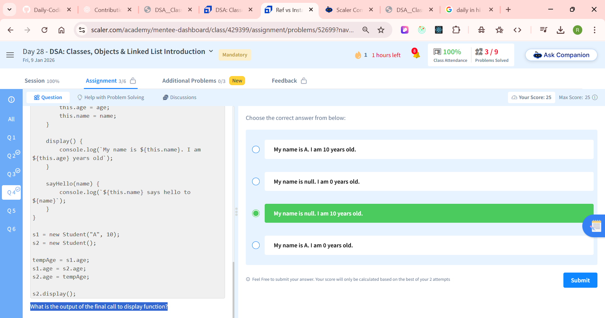
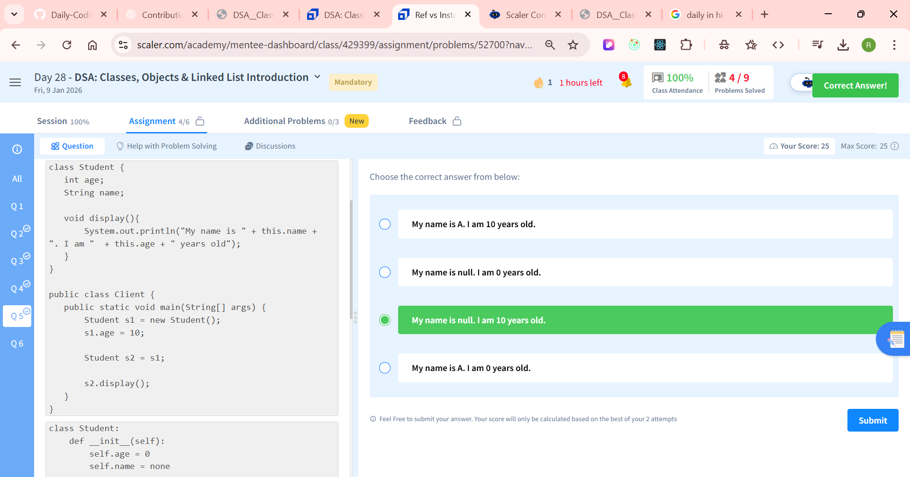

## --- Q-1: 
Problem Description

You are given A which is the head of a linked list. Print the linked list in space separated manner.

Note : The last node value must also be succeeded by a space and after printing the entire list you should print a new line


Problem Constraints

1 <= size of linked list <= 105

1 <= value of nodes <= 109


Input Format

The first argument A is the head of a linked list.


Output Format

You dont need to return anything
Example Input

Input 1:
```
A = 1 -> 2 -> 3
```
Input 2:
```
A = 4 -> 3 -> 2 -> 1
```
Example Output

Output 1:
```
1 2 3
```
Output 2:
```
4 3 2 1
```
ans:
```
/**
 * Definition for singly-linked list.
 * class ListNode {
 *     public int val;
 *     public ListNode next;
 *     ListNode(int x) { val = x; next = null; }
 * }
 */
public class Solution {
    public void solve(ListNode A) {
        ListNode temp = A;
        while(temp != null){
            System.out.print(temp.val + " ");
            temp = temp.next;
        }
        System.out.println();
        
    }
    
}

```

## ================================
```
public class Student {
     int age;
     String name;

     void display(){
             System.out.println("My name is " + this.name + ". I am "  + this.age + " years old");
     }

     void sayHello(String name){
             System.out.println(this.name + " says hello to " + name);
     }
}


public class Client {
   public static void main(String[] args) {
       Student s1 = new Student();
       s1.age = 10;
       s1.name = "A";
       s1.display();

       Student s2 = s1;
       s2.age = 20;
       s2.name = "B";

       s2.display();

       s1.display();
   }
}
```
## --- Q-2:  What is the output of the final call to display function i.e. s1.display()? --
### ✅ Final Answer (Short)

The output of the **final call** `s1.display()` is:

```
My name is B. I am 20 years old
```

---

## 🧠 Step-by-Step Explanation (Very Important Concept)

This question tests **object references in Java**, not object copying.

---

## 1️⃣ Object Creation

```java
Student s1 = new Student();
```

* A **Student object** is created in **heap memory**
* `s1` is a **reference variable** pointing to that object

```text
s1 ───► Student(age=0, name=null)
```

---

## 2️⃣ Assigning Values to `s1`

```java
s1.age = 10;
s1.name = "A";
```

Now the object becomes:

```text
s1 ───► Student(age=10, name="A")
```

Calling:

```java
s1.display();
```

Output:

```
My name is A. I am 10 years old
```

---

## 3️⃣ Reference Copy (IMPORTANT)

```java
Student s2 = s1;
```

⚠️ **No new object is created**

* `s2` points to the **same object** as `s1`

```text
s1 ─┐
    ├──► Student(age=10, name="A")
s2 ─┘
```

---

## 4️⃣ Modifying Object Using `s2`

```java
s2.age = 20;
s2.name = "B";
```

Since both references point to the **same object**, the object becomes:

```text
Student(age=20, name="B")
```

Calling:

```java
s2.display();
```

Output:

```
My name is B. I am 20 years old
```

---

## 5️⃣ Final Call: `s1.display()` ❗

```java
s1.display();
```

* `s1` still points to the **same object**
* The object's values are now:

  * `name = "B"`
  * `age = 20`

### ✅ Final Output:

```
My name is B. I am 20 years old
```

---

## 🔑 Key Concept (Interview Gold ⭐)

> **In Java, objects are accessed via references.
> Assigning one object reference to another does NOT create a new object.**

---

## 📝 One-Line Explanation (Exam Ready)

> Since `s1` and `s2` reference the same `Student` object, changes made through `s2` affect the object accessed by `s1`. Therefore, `s1.display()` prints the updated values.

---

If you want:
✅ Diagram-based memory explanation
✅ Difference between reference copy & object copy
✅ `clone()` vs copy constructor
✅ Similar tricky interview questions

Just tell me 👍


## -- Q-3: What is the output of the final call to display function? --
````
public class Student {
   int age;
   String name;

   void display(){
       System.out.println("My name is " + this.name + ". I am "  + this.age + " years old");
   }

   void sayHello(String name){
       System.out.println(this.name + " says hello to " + name);
   }
}

public class Client {
   public static void main(String[] args) {
       Student s1 = new Student();
       s1.age = 10;
       s1.name = "A";

       Student s2 = new Student();

       Student temp = s1;
       s1 = s2;
       s2 = temp;

       s2.display();

   }
}
````
ans:
### ✅ Output of the program

```
My name is A. I am 10 years old
```

---

## 🧠 Step-by-Step Explanation (Reference swapping)

This question tests **object references and swapping in Java**.

---

## 1️⃣ Object creation

```java
Student s1 = new Student();
s1.age = 10;
s1.name = "A";
```

* One `Student` object is created in heap.
* `s1` points to it.

```text
s1 ───► Student(age=10, name="A")
```

---

```java
Student s2 = new Student();
```

* A **second Student object** is created.
* No values assigned yet → default values.

```text
s2 ───► Student(age=0, name=null)
```

---

## 2️⃣ Reference swapping logic

```java
Student temp = s1;
```

```text
temp ───► Student(age=10, name="A")
```

---

```java
s1 = s2;
```

```text
s1 ───► Student(age=0, name=null)
```

---

```java
s2 = temp;
```

```text
s2 ───► Student(age=10, name="A")
```

✔ **Only references are swapped, not objects**

---

## 3️⃣ Final object-reference state

| Reference | Points to                 |
| --------- | ------------------------- |
| `s1`      | Student(age=0, name=null) |
| `s2`      | Student(age=10, name="A") |

---

## 4️⃣ Execution of `s2.display()`

```java
s2.display();
```

Since `s2` now points to the object with:

* `name = "A"`
* `age = 10`

### ✅ Output:

```
My name is A. I am 10 years old
```

---

## 🔑 Key Concepts (Interview ⭐)

1. Java uses **reference variables for objects**
2. Assignment swaps **references**, not actual objects
3. Objects remain unchanged unless their fields are modified
4. `temp` is used to safely swap references

---

## 📝 One-line Exam Answer

> The output is `My name is A. I am 10 years old` because after swapping references, `s2` points to the original object created by `s1`.

---

If you want:
✅ Memory diagram questions
✅ Object swap vs data swap
✅ Similar tricky MCQs
✅ `null` behavior & default values

Just tell me 👍

## ------ Q-4: What is the output of the final call to display function? --
```
public class Student {
   int age;
   String name;

   void display(){
       System.out.println("My name is " + this.name + ". I am "  + this.age + " years old");
   }

   void sayHello(String name){
       System.out.println(this.name + " says hello to " + name);
   }
}

public class Client {
   public static void main(String[] args) {
       Student s1 = new Student();
       s1.age = 10;
       s1.name = "A";

       Student s2 = new Student();

       int tempAge = s1.age;
       s1.age = s2.age;
       s2.age = tempAge;

       s2.display();

   }
}
```
ans: 


## ----- Q-5: What is the output of the final call to display function? --
```
class Student {
   int age;
   String name;

   void display(){
       System.out.println("My name is " + this.name + ". I am "  + this.age + " years old");
   }
}

public class Client {
   public static void main(String[] args) {
       Student s1 = new Student();
       s1.age = 10;

       Student s2 = s1;

       s2.display();
   }
}
```
ans:


## ------- Q-6: ----
Problem Description

You are given a singly linked list and an integer k. Your task is to access the node at the k-th index (0-based indexing) in the list and return its value. If the index is out of bounds, return -1.


Problem Constraints

k<=10^6


Input Format

The first argument is a pointer to the head of the linked-list.

The second argument is a positive integer K.


Output Format

A single integer, which is the value of the k-th node in the Linked List.

Example Input
```
1->3->5->7->9
2
```
Example Output
```
5
```
ans:
```
/**
 * Definition for singly-linked list.
 * class ListNode {
 *     public int val;
 *     public ListNode next;
 *     ListNode(int x) { val = x; next = null; }
 * }
 */
public class Solution {
    public int solve(ListNode A, int B) {
        int index = 0;
        ListNode current = A;
        while( current != null){
            if(index == B){
                return current.val;
            }
            current = current.next;
            index ++;
        }
        return -1;
    }
}
```
