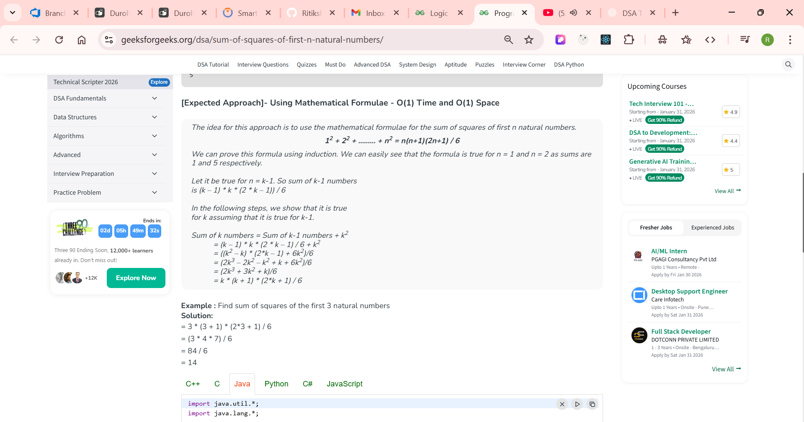

## --- Basic Problems --
1) Check Even or Odd
2) Multiplication Table
3) Sum of Naturals
4) Sum of Squares of Naturals
5) Swap Two Numbers
6) Closest Number
7) Dice Problem
8) Nth Term of AP

## ------------ problem_2(Given a number n, we need to print its table. ) --
Given a number n, we need to print its table.

Examples :
- Input:
```declarative
5
```

- Output:
```declarative
5 * 1 = 5
5 * 2 = 10
5 * 3 = 15
5 * 4 = 20
5 * 5 = 25
5 * 6 = 30
5 * 7 = 35
5 * 8 = 40
5 * 9 = 45
5 * 10 = 50
```

Input: 
```declarative
2
```
Output:
```declarative
2 * 1 = 2
2 * 2 = 4
2 * 3 = 6
2 * 4 = 8
2 * 5 = 10
2 * 6 = 12
2 * 7 = 14
2 * 8 = 16
2 * 9 = 18
2 * 10 = 20
```


## --- Q-3: (Program for sum of n natural numbers)
## -- Q-4: (Program for Sum of squares of first n natural numbers)--

Given a positive integer n, we have to find the sum of squares of first n natural numbers.
- Examples
- Input : 
```declarative
 n = 2
```
Output: 
```declarative
5
```
Explanation: 
```declarative
1^2+2^2 = 5
```

Input :
```declarative
n = 8
```
Output: 
```declarative
204
```
Explanation :  
```declarative
1^2 + 2^2 + 3^2 + 4^2 + 5^2 + 6^2 + 7^2 + 8^2 = 204 
```

# - solution: --

- [Expected Approach]- Using Mathematical Formulae - O(1) Time and O(1) Space
The idea for this approach is to use the mathematical formulae for the sum of squares of first n natural numbers.
```declarative
12 + 22 + ......... + n2 = n(n+1)(2n+1) / 6
```
We can prove this formula using induction. We can easily see that the formula is true for n = 1 and n = 2 as sums are 1 and 5 respectively.

Let it be true for n = k-1. So sum of k-1 numbers
is (k – 1) * k * (2 * k – 1)) / 6

In the following steps, we show that it is true
for k assuming that it is true for k-1.

Sum of k numbers = Sum of k-1 numbers + k2
```declarative
= (k – 1) * k * (2 * k – 1) / 6 + k2
= ((k2 – k) * (2*k – 1) + 6k2)/6
= (2k3 – 2k2 – k2 + k + 6k2)/6
= (2k3 + 3k2 + k)/6
= k * (k + 1) * (2*k + 1) / 6
```
Example : Find sum of squares of the first 3 natural numbers
Solution:
```declarative
= 3 * (3 + 1) * (2*3 + 1) / 6
= (3 * 4 * 7) / 6
= 84 / 6
= 14
```


## -- Q-5: (Swap Two Numbers) ---
Given two numbers a and b, the task is to swap them.

Examples:

Input: 
```
a = 2, b = 3
```
Output: 
```declarative
a = 3, b = 2
```

Input: 
```declarative
a = 20, b = 0
```
Output: 
```declarative
a = 0, b = 20
```
Input: 
```declarative
a = 10, b = 10
```
Output: 
```declarative
a = 10, b = 10
``` 

soluation:
- Swap Two Numbers Without Using Third Variable
  Given two variables a and y, swap two variables without using a third variable.

Examples:
```declarative

Input: a = 2, b = 3
Output: a = 3, b = 2

Input: a = 20, b = 0
Output: a = 0, b = 20

Input: a = 10, b = 10
Output: a = 10, b = 10
```
## Approach-1: Using Arithmetic Operators ---
1) Store the sum of a and b in a (a = a + b).
2) Get the original value of a, that is (sum - original value of b)and store it in b (b = a - b).
3) Get the original value of b, that is (sum - original value of a)and store it in a (a = a - b).

- Time Complexity: O(1)
- Auxiliary Space: O(1)
```java
// Java Code to swap two numbers using arithmetic operators

class GfG {
    public static void main(String[] args) {
        int a = 2, b = 3;
        System.out.println("a = " + a + " b = " + b);   
      
        a = a + b;
        b = a - b;
        a = a - b;
      
        System.out.println("a = " + a + " b = " + b);
    }
}
```
## Approach- Using Bitwise XOR
The idea is to use the properties of XOR to swap the two variables.

- a = a ^ b: Store the Bitwise XOR of a and b in a. Now, a holds the result of (a ^ b).
- b = a ^ b: Bitwise XOR the new value of a with b to get the original value of a. This gives us, b = (a ^ b) ^ b = a.
- a = a ^ b: Bitwise XOR the new value of a with the new value of b (which is the original a) to get the original value of b. This gives us, a = (a ^ b) ^ a = b.

Finally, a and b hold the swapped values.

Time Complexity: O(1)
Auxiliary Space: O(1)

```java
// Java Code to swap two numbers using bitwise XOR

class GfG {
    public static void main(String[] args) {
        int a = 2, b = 3;
        System.out.println("a = " + a + " b = " + b);   
      
        a = a ^ b;
        b = a ^ b;
        a = a ^ b;
      
        System.out.println("a = " + a + " b = " + b);
    }
}
```

## Apporoach-3: [Alternate Approach] Built-in Swap --
We can also swap using built-in functionalities like swap() function in C++, tuple unpacking in Python, destructuring assignment in JavaScript.

Time Complexity: O(1)
Auxiliary Space: O(1)

```javascript
// JavaScript Code to swap two numbers using destructuring assignment

let a = 2, b = 3;
console.log("a = " + a + " b = " + b);   

// destructuring assignment
[a, b] = [b, a]

console.log("a = " + a + " b = " + b);
```
## ----- Q-6: Closest Number( Find Closest to n and Divisible by m)
Given two integers n and m (m != 0). Find the number closest to n and divisible by m. If there is more than one such number, then output the one having maximum absolute value.

Examples:
```
Input: n = 13, m = 4
Output: 12
Explanation: 12 is the closest to 13, divisible by 4.

Input: n = -15, m = 6
Output: -18
Explanation: Both -12 and -18 are closest to -15, but -18 has the maximum absolute value.
```

Great question 👍 — this is a **very common interview problem**, and it’s all about **math intuition + edge cases**.

---

## 🔹 Problem Statement (Clean)

Given two integers **n** and **m**,
find the **number closest to `n` that is divisible by `m`**.

If there are **two such numbers equally close**, return the **larger one**
(this is the standard convention used in most problems).

---

## 1️⃣ Naive Approach (Brute Force)

### Idea

* Keep checking numbers around `n`
* Increase and decrease until you find a number divisible by `m`

### Pseudo-code

```text
for d = 0 to infinity:
    if (n - d) % m == 0 → return (n - d)
    if (n + d) % m == 0 → return (n + d)
```

### Time Complexity ❌

* Worst case: **O(m)**

---

## 2️⃣ Optimized Approach (Math Based) ✅

### 🧠 Key Insight

Any number divisible by `m` looks like:

```
k * m
```

So we just need to find the **nearest multiple of `m`** to `n`.

---

## 🔑 Steps

1. Compute remainder:

```java
r = n % m
```

2. Two candidates:

```text
lower = n - r
upper = n + (m - r)
```

3. Compare distances:

```text
distance to lower = r
distance to upper = m - r
```

4. Pick the closest one
   👉 If tie → return **upper**

---

## 3️⃣ Dry Run (Very Important)

### Example 1

```
n = 13, m = 4
```

#### Step 1

```
r = 13 % 4 = 1
```

#### Step 2

```
lower = 13 - 1 = 12
upper = 13 + (4 - 1) = 16
```

#### Step 3

```
|13 - 12| = 1
|16 - 13| = 3
```

#### ✅ Answer

```
12
```

---

### Example 2 (Tie case)

```
n = 14, m = 4
```

```
r = 14 % 4 = 2
lower = 12
upper = 16
distance both = 2
```

👉 Tie → return **larger**

✅ Answer:

```
16
```

---

## 4️⃣ Dry Diagram 📊

```
Multiples of 4:
... 8 ---- 12 ---- 16 ---- 20 ...

                 n = 14
            ← 2 →     ← 2 →

Closest → 16 (larger one)
```

---

## 5️⃣ Java Code (Optimized & Interview Ready)

```java
public class Solution {
    public static int closestDivisible(int n, int m) {

        int r = n % m;

        if (r == 0) return n;

        int lower = n - r;
        int upper = n + (m - r);

        // If tie, return larger
        if (n - lower < upper - n) {
            return lower;
        } else {
            return upper;
        }
    }
}
```

---

## 6️⃣ Edge Cases to Mention in Interview

✔ `n` already divisible by `m`
✔ Tie case
✔ Large values
✔ Negative `n` (depends on language modulo rules)

---

## 7️⃣ Complexity

| Metric | Value    |
| ------ | -------- |
| Time   | **O(1)** |
| Space  | **O(1)** |

---

## 🎤 Interview Explanation (Perfect Answer)

> “I find the remainder when n is divided by m.
> Then I compute the nearest lower and upper multiples of m and return the one with minimum distance.
> If both are equally close, I return the larger one.”

---

If you want, next I can:

* Handle **negative numbers properly**
* Convert this to **LeetCode / GFG format**
* Show **why naive is bad**
* Add **visual test cases**

Just tell me 💪

## Q-7: Dice Problem(The dice problem)
You are given a cubic dice with 6 faces. All the individual faces have a number printed on them. The numbers are in the range of 1 to 6, like any ordinary dice. You will be provided with a face of this cube, your task is to guess the number on the opposite face of the cube.

Examples:
```declarative
Input: n = 2
Output: 5
Explanation: For dice facing number 5 opposite face will have the number 2.

Input: n = 6
Output: 1
Explanation: For dice facing number 6 opposite face will have the number 1.
```
code:
```java

function oppositeFaceOfDice(n) {
    // Stores number on opposite face
    // of dice
    let ans = 7 - n;
    return ans;
}

let n = 2;
console.log(oppositeFaceOfDice(n));
```

## Q:8 Nth Term of AP(Nth term of AP from First Two Terms)
Given two integers a1 and a2, the first and second terms of an Arithmetic Series respectively, the problem is to find the nth term of the series.
Examples :
```declarative
Input : a1 = 2,  a2 = 3,  n = 4
Output : 5
Explanation : The series is 2, 3, 4, 5, 6, ....   , thus the 4th term is 5.

Input : a1 = 1, a2 = 3, n = 10
Output : 19
Explanation:  The series is: 1, 3, 5, 7, 9, 11, 13, 15, 17, 19, 21..... Thus,10th term is 19.
```
code:
```java
// Q:8 Nth Term of AP(Nth term of AP from First Two Terms)

import java.util.Arrays;

public class Problem_8 {
    // creating prefix-sum
    public static int[] prefix(int[] a , int variant,int first){
        int[] prefix = new int[a.length];
        prefix[0] = first;
        for(int i = 1; i<a.length; i++){
            prefix[i] = variant + prefix[i-1];
        }
        return prefix;
    }

    public static void main(String[] args)
    {
        int a1 = 1, a2=3 , x = 10;
        int variant = a2 - a1;
        int[] array = new int[x];

        int[] ans = prefix(array, variant, a1);
        System.out.println("array is:"+ Arrays.toString(ans));
    }
}
output is: array is:[1, 3, 5, 7, 9, 11, 13, 15, 17, 19]
```
Nice question 👍 — and good that you’re thinking about **time & space complexity**, that’s very interview-relevant.

Let’s analyze your code **line by line** and then give the **final complexity**.

---

## 🔹 What your code is doing

You want to find the **Nth term of an AP**, but instead of using the formula, you are:

* Creating an array of size `x`
* Building the **entire AP sequence** using a prefix-like approach

Example:

```
a1 = 1
a2 = 3
Common difference (d) = 2
x = 10

Generated AP:
[1, 3, 5, 7, 9, 11, 13, 15, 17, 19]
```

---

## 🧠 Time Complexity Analysis

### Method: `prefix()`

```java
for (int i = 1; i < a.length; i++) {
    prefix[i] = variant + prefix[i - 1];
}
```

* Loop runs **n = a.length = x** times
* Each iteration does **O(1)** work

### ✅ Time Complexity

```
O(n)
```

(where `n = x`, number of terms)

---

## 🧠 Space Complexity Analysis

### Extra memory used:

```java
int[] prefix = new int[a.length];
```

* You allocate a new array of size `n`

### ✅ Space Complexity

```
O(n)
```

---

## 📊 Final Complexity Summary

| Metric           | Value    |
| ---------------- | -------- |
| Time Complexity  | **O(n)** |
| Space Complexity | **O(n)** |

---

## ❗ Important Interview Insight

> For **finding only the Nth term of an AP**, this approach is **overkill**.

---
## [Naive Approach] - Using for Loop 
In an Arithmetic Series, the difference between all pair of consecutive terms is same, for example, 2, 5, 8, 11, 14,,,,, The common difference is 3.

- Find the common difference of the series, common difference d = a2 - a1
- Run a loop to iterate over each term in the series from a1, keep adding common difference d until the n-th term is reached.
- Time Complexity - O(n) and Auxiliary Space - O(1)

```java
public class Main {
    public static int nthTermOfAP(int a1, int a2, int n)
    {
        int nthTerm = a1, d = a2 - a1;
        for (int i = 1; i < n; i++) {
            nthTerm += d;
        }
        return nthTerm;
    }

    public static void main(String[] args)
    {
        int a1 = 2, a2 = 3;
        int n = 4;
        System.out.println(nthTermOfAP(a1, a2, n));
    }
}
output is: 5
```
## 🔥 Optimized Approach (Best for Interviews)

### Formula:

```
Nth term = a1 + (n - 1) * d
```

### Java Code:

```java
int nthTerm = a1 + (x - 1) * variant;
```

### Complexity:

| Metric | Value    |
| ------ | -------- |
| Time   | **O(1)** |
| Space  | **O(1)** |

---

## 🎤 Interview Explanation (Perfect Answer)

> “My current solution builds the entire AP sequence, which takes O(n) time and space.
> However, since we only need the Nth term, we can use the AP formula to get it in constant time and space.”

---

## 🔑 Final Takeaway Rule

| Task               | Best Approach         |
| ------------------ | --------------------- |
| Generate entire AP | O(n) time, O(n) space |
| Find only Nth term | O(1) time, O(1) space |

If you want next:

* Convert this to **prefix-sum intuition**
* Handle **large values (overflow)**
* Compare **loop vs formula in interviews**

Just tell me 💪
